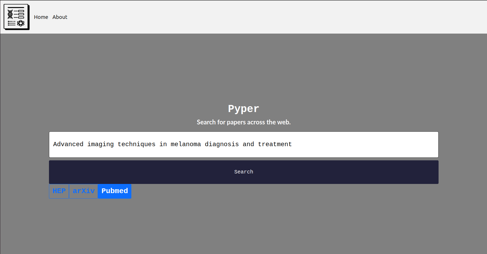
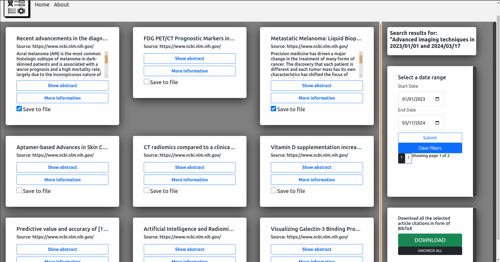
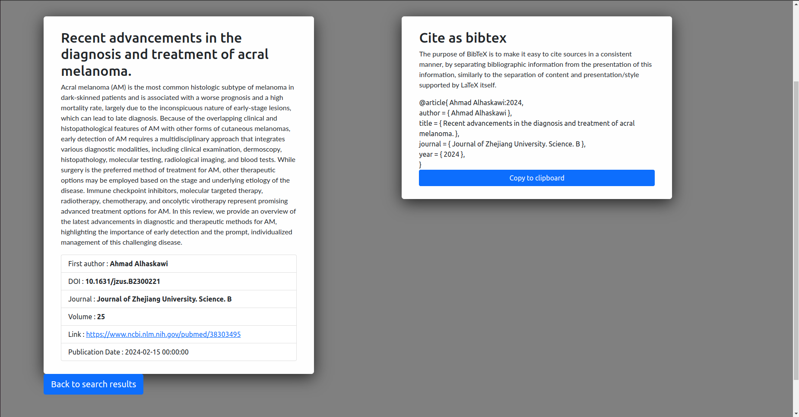

# Pyper

Welcome to the Pyper project! This Flask-based web application is designed to streamline your research by enabling efficient, simultaneous searches across three major scientific databases: PubMed, arXiv, and HEPInspire. With a user-friendly interface and a host of powerful features.

## Features

- **Simultaneous Searches**: Perform searches across PubMed, arXiv, and HEPInspire with a single query.
- **Duplicate Filtering**: Automatically filters out duplicate results that appear in multiple databases, ensuring a clean and concise set of search results.
- **Date Range Filtering**: Refine your search results by specifying custom date ranges, allowing you to focus on the most relevant and recent publications.
- **Detailed Article Information**: Access full information on articles, including authors, publication dates, abstracts, and more, with just a click.
- **Quick Abstract Lookup**: Quickly view abstracts to assess the relevance of articles without leaving your search results.
- **Article Bookmarking**: Easily mark and save articles of interest. Your selections are stored for the duration of the session.
- **BibTeX Export**: Download a BibTeX list of all your marked articles for easy citation management in your academic work.
- **One-Click BibTeX Copy**: Copy BibTeX entries to your clipboard with a single click, streamlining the citation process.
- **Pagination**: Browse through search results with ease using the pagination feature, making it simple to navigate through extensive lists of articles.

## Getting Started

To get started with the Pyper, follow these simple setup instructions.

### Prerequisites

This project uses [Poetry](https://python-poetry.org/) for dependency management. Ensure Poetry is installed on your system to manage project dependencies easily. For installation instructions, visit the [official Poetry documentation](https://python-poetry.org/docs/#installation).

## Demo

*Figure 1: Search Interface*

*Figure 2: Results Page*

*Figure 3: Article Detail View*
